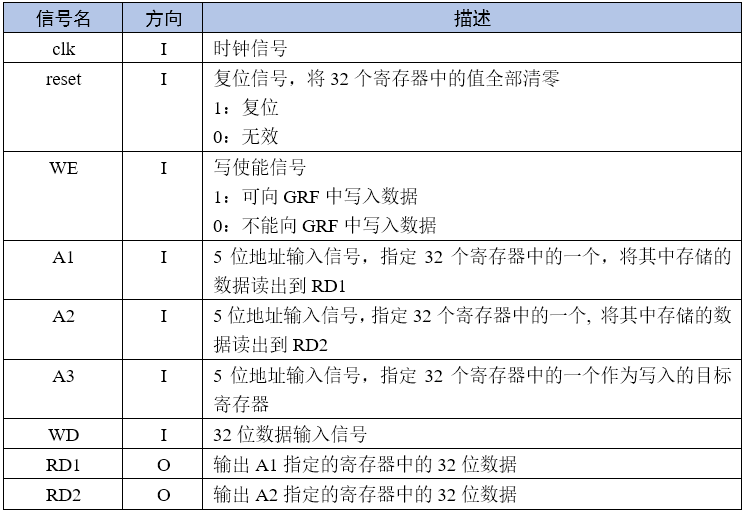
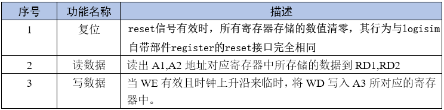
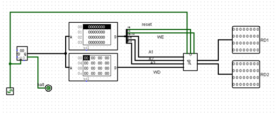
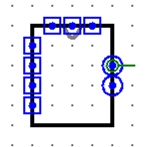

# 实现 GRF(P0.Q2)

## 提交要求

使用 Logisim 搭建一个 GRF。

GRF 中包含 32 个 32 位寄存器，分别对应 0~31 号寄存器，其中 0 号寄存器读取的结果恒为 0。具体模块端口定义如下：

模块功能定义如下：

- 必须严格按照模块的端口定义
- **0 号寄存器读出的数据在任何时刻都为 0**
- **请使用寄存器部件来实现 GRF 中的 32 个寄存器**
- 文件内模块名: grf
- 测试电路：(grf 为你需要搭建的电路)

- **注意:请保证模块的 appearance 与下图完全一致，否则有可能造成评测错误**(查看模块 appearance 方法:在Logisim 中打开相应模块后点击左上角按钮)

