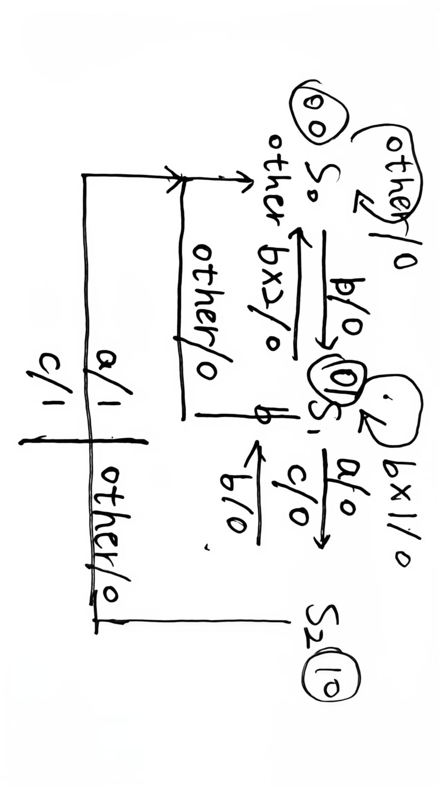

这一道题 Lunemere 觉得很有难度，他在早上 9:00 开始写这道题，写到11点才做出来（当然这是因为 Lunemere 比较菜）:sob::sob::sob: 而且还有一件悲剧的事情，开始他发现了题目直接开始做，做完了发现无法提交，问助教才知道开始的开放是弄错了​

这一题需要去按照当前情况去选择不同的输入，中间正下方的 `Register` 可以看作是 Verilog 里面的case情况，把它分为了不同的状态去处理，然后 MUX的前面则是不同状态机状态下的根据输入进行分流的状态变化

如上是我画的一个状态机，backup是我debug之前的状态，这个状态机实际上是有点问题的，从 `S1` 到 `S0` 时，b * 2应该直接在 `S1` 打转，不过还好，后面debug出来了，关于测试用例的构造方法可以看另外一个md文件