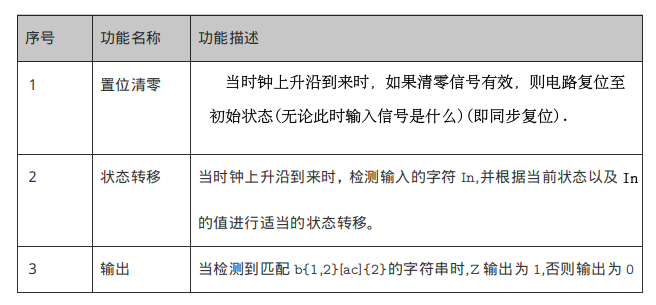
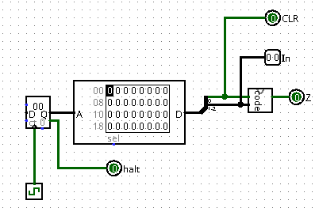
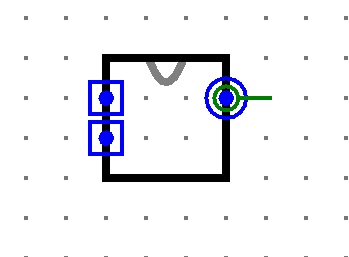

# Logisim中的FSM(P0.Q4)

## 正则表达式匹配

正则表达式是对字符串操作的一种逻辑公式，它通常被用来检索、替换符合某个模式的文本。它的规则比较复杂，我们现在只讲解其中比较简单的几种规则。

- [...]是指要匹配中括号中的字符(注意是字符不是字符串),比如[xyz]就是要匹配x y z这三个字符中的任意一个。
- {...}是指要求匹配”{“前的那个字符几次，比如a{2}是指要匹配a两次，a{2,4}是指要匹配a 2至4次,a{,4}指要匹配a 0至4次，a{2,}指要匹配a 2至无穷次。所以[cd]{1,2}就是要求匹配(c或d)一次或两次,即cc、dd、cd、dc、c、d都是能匹配的。
- (...)是指将()内的字符串视为一个整体，比如(ab){1,2}对应的就是ab或abab。
- 我们也可以将多条表达式组合起来，如a{2}b{2}就是指匹配a两次后再匹配b两次,即匹配aabb。

## 提交要求

使用Logisim搭建一个Mealy型有限状态机 检测串行输入字符串中的能匹配正则表达式b{1,2}[ac]{2}的子串并输出。具体模块端口定义如下：

| 信号名  | 方向 | 描述                                                         |
| ------- | ---- | ------------------------------------------------------------ |
| In[1:0] | I    | 串行方式输入字符串。 为简化电路，我们规定 00 表示 'a'，01 表示 'b'，10 表示 'c'，11 表示其他字符。 |
| CLR     | I    | 清除置位信号                                                 |
| Z       | O    | 输出是否检测到了与表达式匹配的子串 1：检测到了 0：未检测到   |

模块功能定义如下：

- 必须严格按照模块的端口定义
- 文件内模块名: fsm
- **注意: 每当匹配到一个子串时，需要输出一次1。例如对字符串bacbacac,模块应当在第1个c输入和第2个c输入时输出1,而在其他时刻保持输出为0。**
- **注意：有限状态机的设计是Mealy型有限状态机。**
- 测试电路如下：(code部分是你需要搭建的电路)

- **注意:请保证模块的appearance与下图完全一致，否则有可能造成评测错误**(查看模块appearance方法:在Logisim中打开相应模块后点击左上角按钮)

