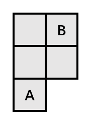
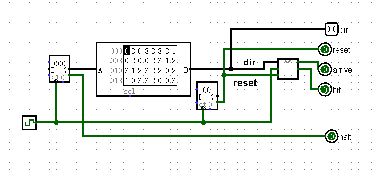
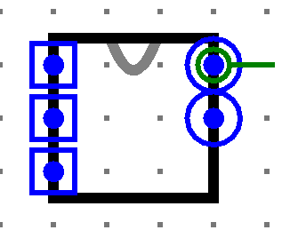

# Logisim 导航(P0.Q3)

## 提交要求

计小组要去机房上机考试，需要去 B 机房，但是目前他在 A 机房。他现在的时间很充裕，就决定生成一串随机序列，告诉他下一步行走的方向，直到走到 B 机房。他希望用 Logisim 搭建一个可以导航的 Moore 型有限状态机，来通过序列告诉他是否到达 B 机房。

题目要求：

计小组只能往东南西北四个方向行走，且若能行走，则每次**只能行走一格**。若下一步不存在机房让计小组行走，那么计小组会撞到墙壁并且 **hit 置高一周期**，此时计小组仍**保持原地**不会移动，等待下一周期再进行运动。（如果下一步依旧撞墙， 则 hit 仍然置高；若下一步不会撞墙，则计小组将会继续行进，hit 在此周期置 0）

计小组走到 B 机房后，**“到达”信号需要置位**，**并保持一周期**。到达B机房后计小组将会在下一周期回到原点，（下一周期的输入将被忽略掉）等待下下周期的输入，继续测试他的序列。

计小组遵循上北下南左西右东的方向完成操作。

计小组在时钟上升沿的时候就已经知道自己下一步的方向并且瞬移过去，并且立即做出判断。

端口定义：

| 信号名   | 方向 | 描述                                                        |
| :------- | :--- | :---------------------------------------------------------- |
| dir[1:0] | I    | 表示行走的方向：00：向北走 01：向东走 10：向南走 11：向西走 |
| clk      | I    | 时钟信号                                                    |
| reset    | I    | 异步复位信号                                                |
| arrive   | O    | 是否到达                                                    |
| hit      | O    | 是否撞上墙壁                                                |

**模块名**：navigation

**必须严格按照模块的端口定义**

**测试电路**：

**注意：请保证模块的 appearance 与下图完全一致，否则有可能造成评测错误**(查看模块 appearance 方法:在 Logisim 中打开相应模块后点击左上角按钮)

