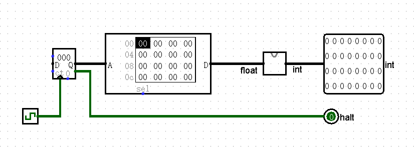
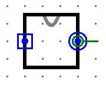

# ftoi(附加题)

本题为附加题，通过与否不计入 P0 课下通过条件。

## 提交要求

使用 Logisim 进行组合逻辑设计，要求输入一个 16 位的单精度浮点数（符合 IEEE-754 标准），输出该浮点数的整数部分(包含符号)，用 32 位二进制符号数表示。

模块端口定义如下：

|   信号名    | 方向 |                             描述                             |
| :---------: | :--: | :----------------------------------------------------------: |
| float[15:0] |  I   |              16 位半精度浮点数（IEEE-754 标准）              |
|  int[31:0]  |  O   | 该浮点数的整数部分（带符号），用32位符号数的补码来表示，超出表示范围则取低 32 位。 **第 3 类 Infinity 和第 4 类 NaN 为了简化直接输出 0 即可** |

- 必须严格按照模块的端口定义
- 文件内模块名: **ftoi**
- 测试电路：

- **注意:请保证模块的appearance与下图完全一致，否则有可能造成评测错误**(查看模块appearance方法:在Logisim中打开相应模块后点击左上角按钮)

