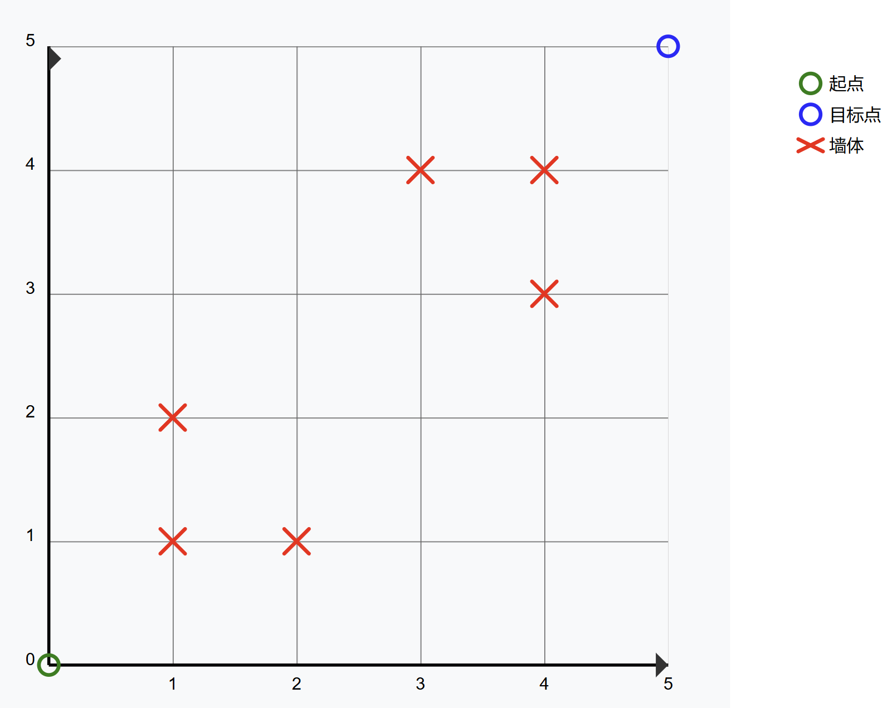
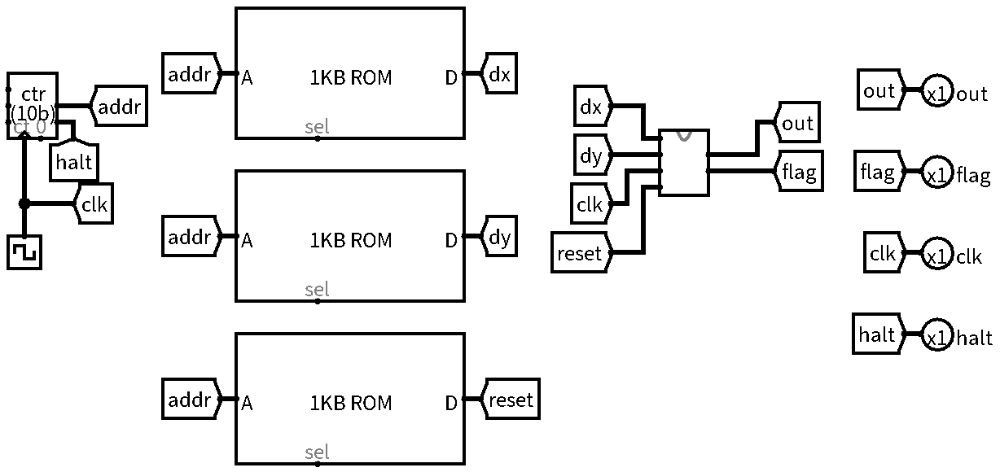
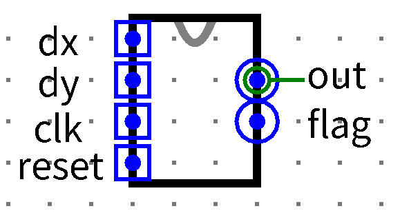
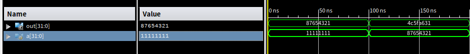

# T1-推箱子

独小星在玩一个简化版的推箱子游戏，请你设计一个状态机，根据输入来判断箱子是否被推到了目标点并输出。

## 提交要求

### 任务要求

游戏地图建立在一个二维平面直角坐标系中，箱子在游戏开始或每次 $reset$ 后位于 $(0,0)$ 坐标处。推箱子的目标点固定位于 $(5,5)$ 坐标处。

游戏地图大小为：以 $(0,0)$ 为左下角，以 $(5,5)$ 为右上角，边长为 $5$ 的正方形（共 $6\times6=36$ 个坐标点）。$(x,y)$ 位于游戏地图内，当且仅当 $0\le x\le5$ 且 $0\le y\le5$。

游戏地图中的坐标点分为墙体和空地。墙体固定为：$(1,1)$、$(1,2)$、$(2,1)$、$(4,4)$、$(4,3)$、$(3,4)$ 这 $6$ 个坐标点。墙体是不可到达区域。

每周期输入一对 $(dx,dy)$，表示箱子的移动变化量。若箱子当前坐标为 $(x,y)$，则箱子的预期落脚点为 $(x+dx,y+dy)$。

如果箱子的预期落脚点是合法的（合法定义见下文），则在下一周期更新箱子的坐标为该落脚点。如果箱子的预期落脚点不合法，则将 $flag$ 置为 $1$ 持续一周期，下一周期箱子坐标保持不动。

保证每周期输入的 $(dx,dy)$ 只会是：$(0,0)$、$(1,0)$、$(0,1)$ 这 $3$ 种中的一种。

箱子的预期落脚点是合法的，**当且仅当该落脚点位于游戏地图内，并且该落脚点不是墙体**。

当箱子坐标位于目标点时，输出 $out$ 为 $1$，否则为 $0$。

游戏地图大致如下：



### 输入输出

| 名称 | 功能 | 位宽 | 方向 |
| --- | --- | --- | --- |
| `clk` | 时钟信号 | 1 | I |
| `reset` | **异步**复位信号 | 1 | I |
| `dx` | 坐标移动变化量 | 1 | I |
| `dy` | 坐标移动变化量 | 1 | I |
| `out` | 箱子是否位于目标点 | 1 | O |
| `flag` | 是否尝试移动到非法坐标 | 1 | O |

- **输入**：保证每周期输入的 $(dx,dy)$ 只会是：$(0,0)$、$(1,0)$、$(0,1)$ 这 $3$ 种中的一种。
- **输出**：$flag$ 默认为 $0$，若当前周期箱子尝试移动到非法坐标，则下一周期 $flag$ 置为 $1$（若有 $reset$ 则立刻复位为 $1$）。
- **文件内模块名**: **Sokoban**
- **测试电路图**：



- **注意：请保证模块的 appearance 与下图一致，否则有可能造成评测错误。注意输入的上下顺序。**



# T2-翻涌数字

## 1、简介

给出一个位宽为 $32$ 的输入 $a$，代表 $8$ 个位宽为 $4$ 的数据，分别命名为 $a_0$、$a_1$、……、$a_7$。

其中 $a_i=a[(i+1)*4-1:i*4]$。

对每一个 $a_i$ 进行操作，使得 $a_i=\sum_{j=0}^{i}a_j$。

对操作后得到的 $a_i$ 按原顺序进行拼接，并输出拼接后的 $a$。

特别的：若 $a_i$ 相加时出现溢出，则保留对 `4'd16` 取余后的结果。

## 2、模块规格

模块名：roll

| 信号名 | 方向 | 描述 |
| --- | --- | --- |
| `a[31:0]` | I | 用于计算的数 |
| `out[31:0]` | O | 计算结果 |

## 3、输入输出样例



如图，当 $a$ 为 `32'h11111111` 时，$out$ 为 `32'h87654321`。

当 $a$ 为 `32'h87654321` 时，$out$ 为 `32'h4c5fa631`。

## 4、提交要求

- 必须严格按照模块的端口名称和方向定义。
- 文件内模块名： roll
- 模块内不要包含任何 `$display` 语句，以防造成误判。

# T3-MIPS_Submatrix

### 功能需求

实现 MIPS 汇编程序：从 $4\times4$ 的大矩阵 $A$ 中提取出指定位置指定大小的子矩阵。

### 输入格式

第 1 - 16 行依次输入大矩阵 $A$ 的元素 $t$（整数，$0\le t\le100$）：

- 第一行：$A$ 第 0 行第 0 列的元素
- 第二行：$A$ 第 0 行第 1 列的元素
- …… （依此类推）

第 17 行输入一个整数 $m$，表示子矩阵的行数（$1\le m\le4$）。

第 18 行输入一个整数 $n$，表示子矩阵的列数（$1\le n\le4$）。

第 19 行输入一个整数 $i$，表示子矩阵的第 0 行第 0 列元素在大矩阵 $A$ 中的行数（$0\le i\le3$）。

第 20 行输入一个整数 $j$，表示子矩阵的第 0 行第 0 列元素在大矩阵 $A$ 中的列数（$0\le j\le3$）。

### 输出格式

1. 若子矩阵完全位于大矩阵内，未超出边界：输出 $m*n$ 子矩阵，共 $m$ 行，每行 $n$ 个元素（空格分隔）。
2. 若超出边界：输出字符串 `Out of bounds`。

### 约定

1. 大矩阵 $A$ 的行索引和列索引从 0 开始编号。
2. 请勿使用 `.globl main`
3. 请使用 `syscall` 结束程序：

```
li $v0, 10
syscall
```

### 输入样例 1

```
1
2
3
4
5
6
7
8
9
10
11
12
13
14
15
16
2
2
1
1
```

### 输出样例 1

```
6 7
10 11
```

### 输入样例 2

```
4
3
2
1
8
7
6
5
12
11
10
9
13
14
15
16
3
2
2
2
```

### 输出样例 2

```
Out of bounds
```
