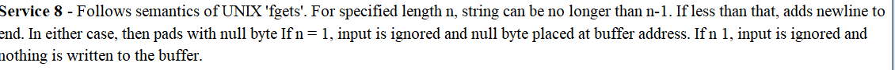
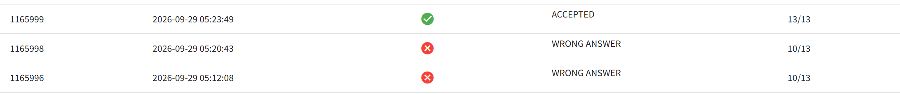

# 遗憾是人生的常态

学会接受上机失败，学会接受1h写完Logisim & Verilog，但是因为一些疏忽2h都没能写完MIPS。不过一次上机不会怎么样，继续向前吧

题目里面的输入字符串保证了输出的字符串只会有大写的 `A ~ Z` ，可是忽略了 MIPS 的一个很基础的知识点，你可以点击 `F1` 进行查看。

用 `8` 进行读取字符串时，MIPS是有可能会在后面加上 '\n' 的，这就导致如果直接按照 C 代码进行翻译，会导致 `3` 个 WA :sob: 

所以这里需要用'\0', '\n' 均作为<mark>终止符</mark>...

课下提交情况：

感谢 @[OceanScenery](https://github.com/OceanScenery) 的思路提供，我们在 `fks` 上面完成了这道题目

由于课上的代码不允许课下下载，所以这里不提供本次上机的代码，仅提供我课下A出来的MIPS~~总不能说我懒得再写一遍了吧~~