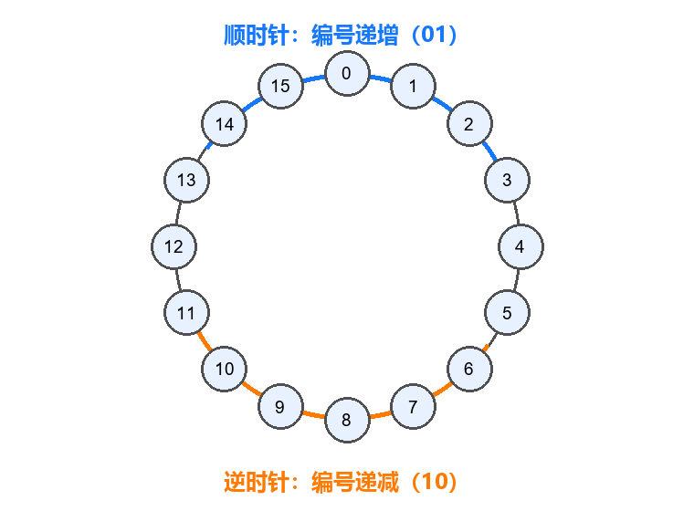
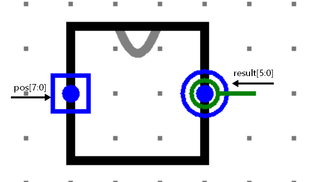

# Verilog-分段饱和加法

## 1、简介

将两个 32 位输入分别看成四个互不相关的 8 位无符号数，对应字节分别做饱和加法。

## 2、功能要求

对每个字节位置分别执行无符号加法，并独立饱和；任何字节的进位都不得影响相邻字节。等价地，对 `i=0,1,2,3`：

```text
out_i = min(a_i + b_i, 255)
```

其中 `a_i=a[8*i+7:8*i]`，`b_i=b[8*i+7:8*i]`，`out_i=out[8*i+7:8*i]`。

## 3、模块规格

模块名：`sat_add`

| 信号名      | 方向 | 描述                 |
| ----------- | ---- | -------------------- |
| `a[31:0]`   | I    | 四个 8 位无符号加数  |
| `b[31:0]`   | I    | 四个 8 位无符号加数  |
| `out[31:0]` | O    | 四个独立饱和加法结果 |

## 4、输入输出样例

输入：`a=32'h01FF807F`，`b=32'h02018081`

输出：`out=32'h03FFFFFF`

解释：最低字节 `7F+81=100`，溢出后饱和为 `FF`；其他字节也分别独立计算，不跨字节传递进位。

## 5、提交要求

- 使用 Verilog HDL，提交文件中的模块名必须为 `sat_add`。
- 端口名称、方向和位宽须与模块规格完全一致。
- 设计为组合逻辑，不得依赖时钟或初始值。
- 模块内不得包含 `$display`、`$monitor` 等仿真输出语句。

# MIPS-相邻字符抵消

## 1、题目描述

给定一个只包含大写英文字母的字符串。若两个相同字符相邻，则它们会同时消失；字符消失后，新形成的相邻字符还要继续按照同样规则抵消，直到不存在相邻且相同的字符。

请使用 MIPS 汇编程序输出最终得到的字符串。最终结果与选择先消去哪一对无关。

例如：

```text
ABBACDDCE -> AACDDCE -> CDDCE -> CCE -> E
```

## 2、输入格式

输入一行字符串，长度为 1 至 1000，只包含 `A` 至 `Z`。

## 3、输出格式

若最终字符串非空，输出最终字符串并换行；若最终字符串为空，输出 `EMPTY` 并换行。

## 4、输入输出样例

### 样例一

输入：

```text
ABBACDDCE
```

输出：

```text
E
```

### 样例二

输入：

```text
ABCCBA
```

输出：

```text
EMPTY
```

## 5、提交要求

1. 请勿使用 `.globl main`。
2. 请使用 `syscall` 结束程序：

```mips
li $v0, 10
syscall
```

## 6、C 语言代码

```c
#include <stdio.h>

#define MAX_LEN 1000

int main(void) {
    char input[MAX_LEN + 1];
    char stack[MAX_LEN + 1];
    int top = 0;

    scanf("%s", input);

    for (int i = 0; input[i] != '\0'; i++) {
        if (top > 0 && stack[top - 1] == input[i]) {
            top--;
        } else {
            stack[top++] = input[i];
        }
    }

    if (top == 0) {
        printf("EMPTY\n");
    } else {
        stack[top] = '\0';
        printf("%s\n", stack);
    }

    return 0;
}
```

# Logisi环城导航

## 1、题目简介

一条环形轨道有 16 个站点，编号为 `0` 到 `15`。给定起点和终点，请设计组合逻辑，判断从起点沿环形轨道到终点的最短距离和方向。

## 2、信号定义

模块名：`main`

| 信号名        | 方向 | 描述                                                         |
| ------------- | ---- | ------------------------------------------------------------ |
| `pos[7:0]`    | I    | `pos[7:4]` 为起点 `start`，`pos[3:0]` 为终点 `target`，范围均为 0 到 15 |
| `result[5:0]` | O    | `result[3:0]` 为最短距离，`result[5:4]` 为方向编码           |

方向编码：`00` 表示起终点相同；`01` 表示沿顺时针方向行进；`10` 表示沿逆时针方向行进；`11` 表示顺时针和逆时针距离相等。环上站点编号按顺时针方向递增（`15` 顺时针后回到 `0`）。距离相等且起终点不同时，距离为 8。

环形站点和方向约定如下图所示：



## 3、示例

例如输入 `pos=8'h2E`（起点 2、终点 14），顺时针需要经过 12 站，逆时针需要经过 4 站，因此输出 `result=6'b10_0100`（逆时针 4 站）。

## 4、提交要求

- 文件内模块名：`main`。
- 测试要求：请以组合逻辑的方式实现。
- 注意：请保证模块的 appearance 与下图完全一致，否则可能造成评测错误；输入端口 `pos[7:0]` 和输出端口 `result[5:0]` 的名称、方向、位宽及上下顺序必须与信号定义一致。


